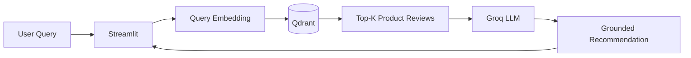

# 🛒 Flipkart Product Recommender Chatbot

> A RAG-based conversational product discovery system that uses semantic search over product reviews and an LLM to generate context-grounded recommendations.

## Problem

Keyword search struggles when users describe what they want indirectly:

> “I need a Bluetooth headset with good bass and long battery life.”

The system converts the query into an embedding, retrieves semantically relevant product reviews, and generates a recommendation using only the retrieved context.

## Architecture



## RAG pipeline

```text
Flipkart review data
    ↓
data conversion
    ↓
LangChain documents
    ↓
BAAI/bge-base-en-v1.5 embeddings
    ↓
Qdrant vector search
    ↓
Top-K reviews
    ↓
Groq-hosted LLM
    ↓
product recommendation
```

## What it demonstrates

- Semantic search instead of keyword-only matching
- Embedding generation
- Vector retrieval with Qdrant
- LangChain RAG orchestration
- Context-grounded generation
- Conversational follow-up questions
- Streamlit application development

## Tech stack

`Python` · `LangChain` · `Groq` · `GPT-OSS 120B` · `BAAI/bge-base-en-v1.5` · `Qdrant` · `Streamlit` · `Pandas`

## Local setup

```bash
git clone https://github.com/Riya-712/Flipkart-product-recommender-chatbot.git
cd Flipkart-product-recommender-chatbot

python -m venv .venv
# Windows
.venv\Scripts\activate

pip install -r requirements.txt
```

Configure Qdrant and the LLM/API environment variables required by the repository.

Then run the ingestion flow:

```bash
python ingest_data.py
```

Start the Streamlit application using the repository's configured app entry point.

## Retrieval configuration

The current design uses:

- Embedding model: `BAAI/bge-base-en-v1.5`
- Vector size: `768`
- Distance: cosine
- Vector database: Qdrant

## Important limitation

This is a **review-based product discovery prototype**, not a complete e-commerce recommendation engine. It does not model real-time inventory, current prices, clickstream behavior, purchase history, collaborative filtering, or personalized user profiles.

## Interview takeaway

> The project demonstrates the complete RAG loop: represent the user's intent as an embedding, retrieve semantically relevant evidence, and generate a response grounded in that evidence.
